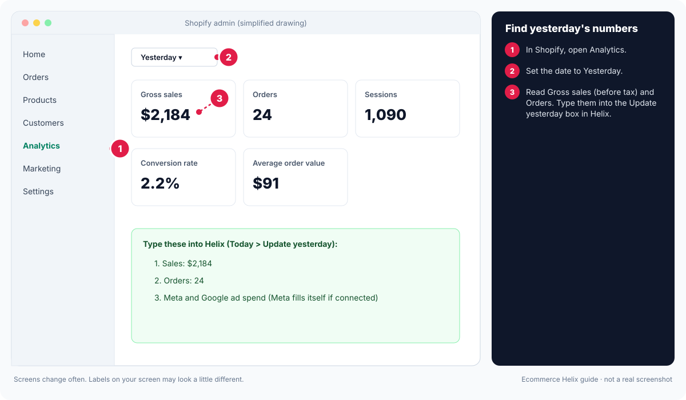
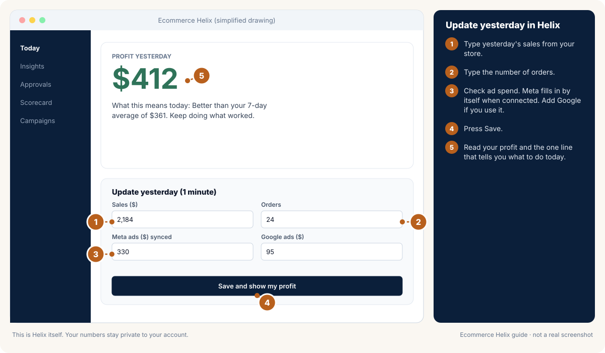

# Module 1: Daily profit foundations

**Outcome:** you know, every morning, whether yesterday made money, and you know the numbers that decide every other choice in this course.

**Time:** 60 to 90 minutes to set up, then 2 minutes a day.
**Related SOPs:** [02 Scorecard](../sops/02-scorecard-and-unit-economics.md), [03 Constraint diagnosis](../sops/03-constraint-diagnosis.md)

<!-- plain:start -->
> **In plain words**
>
> **What it is:** Each morning you check one number: did yesterday make a profit?
>
> **Why it matters:** Sales can go up while you lose money. Profit is what pays you, so every other choice starts here.
>
> **Do this:**
>
> 1. Write down your costs once: product cost, shipping, payment fees and monthly bills.
> 2. Each morning, type yesterday's sales, orders and ad spend into Helix (2 minutes).
> 3. Read the profit number and the one line that tells you what to do today.
>
> **Words to know:**
>
> - **Profit:** What is left from sales after product cost, shipping, payment fees, discounts, refunds and ads. This is the number Helix cares about most.
> - **Revenue:** All the money customers paid. It looks good, but it is not what you keep.
> - **Break-even ROAS:** The ROAS where an order makes $0 profit after its costs. Below it, ads lose money.
> - **MER:** All ad spend divided by all sales, as a percentage. MER 25% means $25 of ads for every $100 of sales.
>
> All words are explained in the [glossary](../glossary.md).
<!-- plain:end -->

---

## Lesson 1.1: Why revenue is the wrong scoreboard

Revenue feels good and tells you almost nothing. A $5,000 day can lose money if ad spend, product cost and shipping eat it. Platform ROAS is worse: each ad platform takes credit for the same sale, so the numbers in Ads Manager often add up to more sales than you actually had.

The scoreboard that matters is **contribution profit**: what is left after the costs that move with each order and after ad spend. Subtract a daily share of fixed costs and you get an estimate of **net profit**.

**Do this now**
- [ ] Write down last month's revenue, total ad spend and what you think you made. You will compare this guess with the real number at the end of this module.

## Lesson 1.2: Your cost drivers

Cost drivers are the averages that turn revenue into profit. You only set them up once and review them every quarter.

**Variable costs (move with each order)**
| Driver | How to estimate |
| --- | --- |
| Product cost % | Landed cost (product + inbound freight + duties) ÷ selling price, averaged across your mix. If your mix varies a lot, weight by last 90 days of units. |
| Fulfilment and shipping per order | 3PL pick and pack + postage, minus what customers pay for shipping. |
| Packaging per order | Box, mailer, tissue, inserts. |
| Payment fees | About 2.6% blended if you do not know. Check your processor reports. |
| Other per-order costs | Marketplace commission, gift with purchase, shipping protection you pay for, buy-now-pay-later fees. |

**Fixed costs (do not move with orders)**
Staff and contractors, owner pay, software and apps, rent, insurance, accounting, loan interest, and **fixed marketing** that is not ad spend (shoots, creator gifting, agency retainers).

**Common questions**
- *Is my own wage a cost?* Yes. Put a fair owner wage into fixed costs, even if you do not pay it yet. Otherwise you will think the business is healthier than it is.
- *Do I include GST or VAT?* Work with revenue and costs excluding tax that you collect and pass on.
- *How do I handle returns?* Use net revenue (after refunds). If returns are significant, add a returns cost per order (return postage, write-offs).
- *Tariffs and duties on export orders?* Add them as a per-order cost for that market, or keep a separate scorecard per country.
- *I manufacture in-house.* Your product cost % includes materials and the variable labour per unit. Salaried production staff go in fixed costs.
- *Wholesale and retail share costs.* Keep online retail separate. Allocate a fair share of fixed costs to wholesale.
- *My costs will change soon.* Version your drivers with a start date so history stays accurate.
- *Average product cost is hard to get.* Start with a sensible estimate from your top 10 sellers. A rough number used daily beats a perfect number never used.
- *Product cost during a sale.* Product cost % rises when you discount, because the price drops while the cost stays. Use a sale-period driver.
- *Several stores or regions.* One scorecard per store or currency, then a combined view.

## Lesson 1.3: The daily scorecard

Each morning record (or let Helix sync): revenue, orders, units, sessions, ad spend per channel, discounts and refunds. Helix calculates:

| Metric | Formula |
| --- | --- |
| Variable costs | Revenue x product cost % + orders x per-order costs + revenue x fee % |
| Contribution profit | Revenue - variable costs - ad spend |
| Net profit (estimate) | Contribution profit - daily fixed allowance |
| MER% | Ad spend ÷ revenue |
| VCR | Variable costs ÷ revenue |
| FCR | Fixed costs ÷ revenue |
| RPV | Revenue ÷ sessions |
| Conversion rate | Orders ÷ sessions |
| AOV | Revenue ÷ orders |
| Cost per visit | Ad spend ÷ sessions |
| Blended CAC | Ad spend ÷ new-customer orders |

**Backfill** 1 to 2 months so you can see trends from day one.

<!-- guide:shopify-1-yesterdays-numbers -->

*Drawing, not a real screenshot. Labels on your screen may look a little different.* Official help: [Shopify: reports and analytics](https://help.shopify.com/en/manual/reports-and-analytics/shopify-reports)
<!-- /guide:shopify-1-yesterdays-numbers -->

<!-- guide:helix-1-daily-update -->

*Drawing, not a real screenshot. Labels on your screen may look a little different.*
<!-- /guide:helix-1-daily-update -->

## Lesson 1.4: Healthy ranges

| Ratio | Healthy | Warning |
| --- | --- | --- |
| Net profit | 10 to 20% | Below 5% |
| MER% | 20 to 35% (falls as repeat customers grow) | Above 45% |
| VCR | 30 to 45% | Above 50%; above 60% makes paid growth very hard |
| FCR | 10 to 20% | Above 30% |

## Lesson 1.5: Your target MER and break-even numbers

**Target MER% = 100% - VCR - FCR - target profit %.**

Example: VCR 40%, FCR 15%, target profit 15%, so target MER is 30%. On a $100 order you can spend $30 on ads, blended across all customers.

**Break-even ROAS for a channel** = 1 ÷ (1 - VCR). With VCR 40%, break-even ROAS is 1.67. Below that, each sale loses money before fixed costs.
**Break-even CPA** = AOV x (1 - VCR). With AOV $100 and VCR 40%, break-even cost per purchase is $60.
**Target CPA** = AOV x target MER = $30 in the example.

## Lesson 1.6: A 2-minute morning routine

1. Open the scorecard. Read yesterday's profit estimate.
2. Look at 3-day and month-to-date MER against target. Pick today's stance (push, careful push, hold, defend).
3. Check one red flag list: site up, checkout working, tracking firing, no stockout on a best seller.
4. Write one line in your decision log.

## Example

A candle store: $1,800 revenue, 30 orders, 900 sessions, $520 ad spend. Product cost 28%, $9 per order fulfilment, $1.20 packaging, fees 2.6%. Fixed costs $9,000 a month.

- Variable costs = 1,800 x 0.306 + 30 x 10.20 = $551 + $306 = $857 (VCR 48%)
- Contribution profit = 1,800 - 857 - 520 = $423
- Fixed allowance = $300 a day. Net profit ≈ $123 (7%)
- MER = 29%. RPV = $2.00. AOV = $60.

Lesson: MER looks fine but VCR at 48% is the real squeeze. Shipping is $9 on a $60 order (15%). The fix is shipping and AOV, not ads.

## Self-check

1. Why is platform ROAS a poor scoreboard?
2. Where does a founder's wage belong?
3. With VCR 45%, FCR 20% and a 10% profit goal, what is target MER?
4. What is break-even CPA with AOV $80 and VCR 40%?
5. MER is on target but profit is thin. Which ratio do you check next?

Answers

1. Platforms double-count and use their own attribution windows; your bank account does not.
2. Fixed costs.
3. 100 - 45 - 20 - 10 = 25%.
4. 80 x 0.6 = $48.
5. VCR (variable costs) and then FCR.

