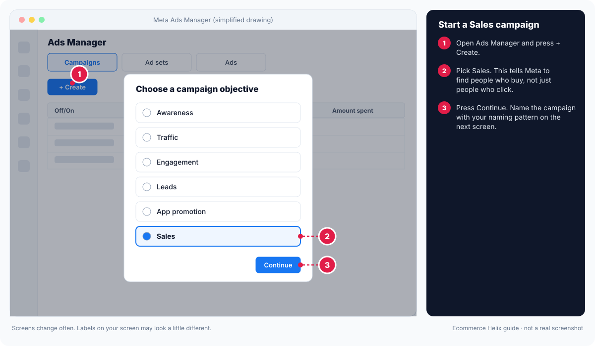
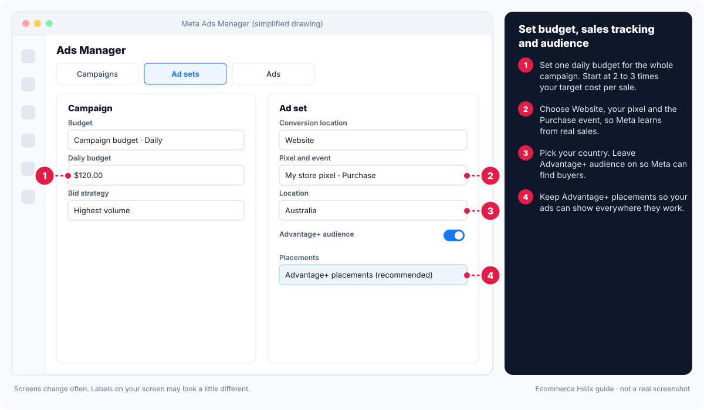
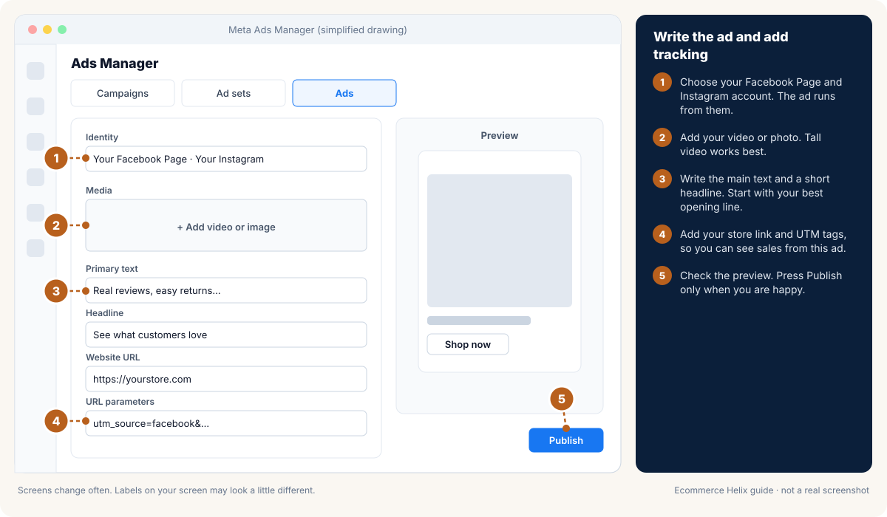
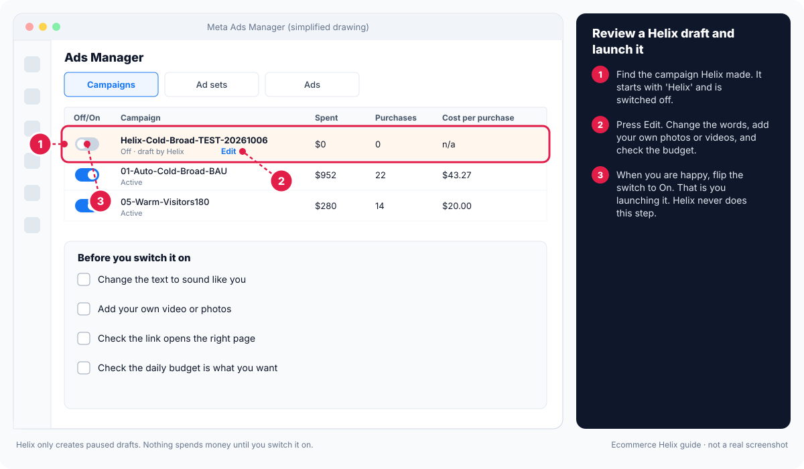

# Module 7: Meta ads in practice

**Outcome:** you can build and run a Meta (Facebook and Instagram) ad account in about 10 minutes a day, and spend more without breaking what works.

**Related SOPs:** [05 Meta structure and scaling](../sops/05-meta-structure-and-scaling.md), [06 Meta daily optimisation](../sops/06-meta-daily-optimisation.md), [07 Creative testing](../sops/07-creative-testing.md)

<!-- plain:start -->
> **In plain words**
>
> **Stage:** Attract (get seen by people who want what you sell). Every lesson below is tagged with its stage; see [Attract, Convert, Grow](stages.md).
>
> **What it is:** How to set up and run Facebook and Instagram ads in about 10 minutes a day.
>
> **Why it matters:** For most stores, Meta is where most new customers come from. Doing the basics well beats clever tricks.
>
> **Do this:**
>
> 1. Set up your pixel so Meta can see sales.
> 2. Start one Sales campaign with broad targeting and 3 ads.
> 3. Each day, check cost per sale against your target and act on the plain-English verdict in Helix.
>
> **Words to know:**
>
> - **Pixel:** A small piece of code on your store that tells Meta when someone views, adds to cart or buys.
> - **Advantage+:** Meta's automatic settings that let its system choose audience, placements or budget for you.
> - **Learning phase:** The first days after you start or change an ad set, while Meta works out who to show it to. Results jump around, so wait.
> - **CPA:** Cost per acquisition: how much ad money it took to get one sale.
>
> All words are explained in the [glossary](../glossary.md).
<!-- plain:end -->

---

## Lesson 7.1: Account setup checklist
<!-- stage:attract -->

**Why this matters:** Ten minutes of setup before you spend money prevents the most expensive Meta problems: lost sales tracking, hacked accounts and runaway spend. Do this once, tick each step, and check it again every quarter.

**Step 1.** In Meta Business Settings (business.facebook.com/settings) go to **Security Centre**, start business verification, add a second admin under **Users > People**, and turn on two-factor authentication (a code from your phone as well as a password) for every admin.

**Expected result:** Security Centre shows verification started or done, two admins, and two-factor on for both.

**Watch out:** One admin is a single point of failure. If that person is locked out or hacked, you lose the account.

**Step 2.** In Shopify install the **Facebook & Instagram** app, connect your pixel (a small piece of code that tells Meta when someone views, adds to cart or buys) and set data sharing to **Maximum** so server events (Conversions API: the same sales sent from your store's server) are on.

**Expected result:** In Events Manager, your pixel shows Purchase events from both **Browser** and **Server**, and the currency matches your store.

<!-- do:meta-connect -->

**Step 3.** In the same app, connect your product catalog and check that sale prices come through.

**Expected result:** **Commerce Manager > Catalog** lists your products with the right prices.

**Step 4.** In **Ad account settings > Audience segments**, set your engaged audience and existing customers.

**Expected result:** Ads Manager can report how much spend reaches new people.

**Step 5.** Build custom audiences: visitors in the last 30 and 180 days, product viewers, add to cart, checkout started, buyers, social engagers and your email list.

**Expected result:** All the audiences show "Ready" in **Audiences**.

**Step 6.** Set up saved columns in Ads Manager (**Columns > Customise columns > Save as preset**) as in [SOP 06](../sops/06-meta-daily-optimisation.md).

**Expected result:** One click shows the numbers you check every day.

**Step 7.** In **Billing > Payment settings**, set an account spending limit as a safety net.

**Expected result:** The account stops spending at your limit even if something goes wrong.

**Step 8.** Every week, check for campaigns you did not create or sudden huge budgets.

**Expected result:** A weekly check is in your calendar. If you find anything: turn it off, remove unknown access, contact Meta support and dispute the charges with your bank.

<!-- do:calendar -->

## Lesson 7.2: Automated vs manual campaigns
<!-- stage:attract -->

**Why this matters:** Meta offers two ways to run campaigns. Automated (Advantage+) campaigns let Meta choose budget split, audience and placements; manual campaigns let you control audience, exclusions and placements. Most accounts use both, each for what it does best.

**Step 1.** Use an automated (Advantage+) Sales campaign for broad cold and mixed audiences.

**Expected result:** Your main prospecting campaign is automated.

<!-- do:meta-draft -->

**Step 2.** Use manual campaigns for warm audiences and for specific tests where you need control.

**Expected result:** Warm and test campaigns are manual, with your chosen audiences.

**Step 3.** In each ad, open **Advantage+ creative** options and turn off automatic carousel or collection conversion if it breaks how your ad looks.

**Expected result:** Your ads show in the format you designed.

## Lesson 7.3: Ad formats
<!-- stage:attract -->

**Why this matters:** The format is the shape of the ad: video, image, carousel and more. Each format suits a different job, and the wrong one can hide a good message.

**Step 1.** For each ad in your next batch, pick the format from the table below that matches its job (for example single video in 9:16 and 4:5 for most cold ads).

**Expected result:** Every brief names one format.

**Step 2.** Make each ad in both 4:5 (feed) and 9:16 (Stories and Reels) sizes.

**Expected result:** Each ad fits every placement without cropping.

**Step 3.** Keep all text inside the safe zones so Reels and Stories do not cut it off or cover it with buttons.

**Expected result:** Previewing the ad in Ads Manager shows no text hidden behind buttons.

### Good to know

| Format | Best for |
| --- | --- |
| Single video (9:16 tall and 4:5) | Most ads aimed at new people |
| Single image (4:5) | Bold statements, offers, reviews |
| Carousel (swipeable cards) | Several products, steps or reasons |
| Catalog ads (dynamic product ads) | Showing people products they looked at; big product ranges |
| Collection | A shopping experience on mobile |
| Partnership ads | A creator's video run from the creator's own account |
| Catalog product video | Product videos made automatically from templates |

## Lesson 7.4: Launching
<!-- stage:attract -->

**Why this matters:** How you launch decides how fairly ads are tested and whether they keep their likes and comments. Building once, copying with the same post and launching in batches gives every ad a fair start.

**Step 1.** In your build campaign (always switched off), create the new ads.

**Expected result:** New ads sit in the paused build campaign.

<!-- do:meta-draft -->

**Step 2.** Copy them into the campaigns where they will run and choose **Use existing post** so likes and comments carry over.

**Expected result:** Each copy shows the same post ID as the original.

**Step 3.** Switch on the whole batch at once, not one ad at a time.

**Expected result:** All new ads start on the same day.

**Step 4.** Wait 2 to 5 days before judging.

**Expected result:** You judge on settled numbers, not early noise.

**Watch out:** Only use ad scheduling for a specific reason, like a sale that starts at a set time.

### Good to know

<!-- guide:meta-1-create-sales-campaign -->

*Drawing, not a real screenshot. Labels on your screen may look a little different.* Official help: [Meta: create a campaign in Ads Manager](https://www.facebook.com/business/help/1658289035439772)
<!-- /guide:meta-1-create-sales-campaign -->

<!-- guide:meta-2-budget-pixel-audience -->

*Drawing, not a real screenshot. Labels on your screen may look a little different.*
<!-- /guide:meta-2-budget-pixel-audience -->

<!-- guide:meta-3-write-the-ad -->

*Drawing, not a real screenshot. Labels on your screen may look a little different.*
<!-- /guide:meta-3-write-the-ad -->

<!-- guide:meta-4-review-helix-draft -->

*Drawing, not a real screenshot. Labels on your screen may look a little different.*
<!-- /guide:meta-4-review-helix-draft -->

## Lesson 7.5: The learning phase
<!-- stage:attract -->

**Why this matters:** The learning phase is the first days after you start or change an ad set, while Meta works out who to show it to. Results are unstable during learning, so knowing what resets it saves you from breaking good campaigns.

**Step 1.** Before editing a live ad set, check whether the edit restarts learning: swapping or adding ads, changing the audience, or changing budget by more than 20%.

**Expected result:** You only make big edits on purpose.

**Step 2.** Launch new tests as new campaigns rather than editing working ones.

**Expected result:** Existing campaigns keep their learning, because new campaigns do not reset them.

**Step 3.** Judge results on the last 7 days, not one day.

**Expected result:** A great week one followed by a weaker week two does not panic you.

**Watch out:** Do not keep moving winning ads into "the best campaign". Copy them instead, so each campaign keeps what it learned.

## Lesson 7.6: Daily optimisation in 10 minutes
<!-- stage:attract -->

**Why this matters:** Ten minutes a day keeps Meta healthy. Five steps in the same order every day turn a confusing dashboard into one clear action. In Helix, **Your ads** shows the verdicts for you.

**Step 1.** Set your stance from your scorecard: push, careful push, hold or defend (Lesson 1.6).

**Expected result:** You have one word for today.

<!-- do:numbers -->

**Step 2.** Check campaign budgets and frequency (how often the same people see your ads) in your saved columns.

**Expected result:** You know whether any campaign is overspending or tiring its audience.

**Step 3.** Grade each ad: **Star** (great: keep and give more), **Steady** (fine: leave), **Passenger** (little spend, little effect: leave unless it starts spending), **Drain** (lots of spend, poor results: turn off).

**Expected result:** Every ad has a grade, and drains are switched off.

**Step 4.** Label each campaign: winning, learning, shaky or dying.

**Expected result:** Every campaign has a label.

<!-- do:insights -->

**Step 5.** Take one action and write it in your decision log. [SOP 06](../sops/06-meta-daily-optimisation.md) has the full detail and numbers.

**Expected result:** One logged action a day, about 10 minutes in total.

## Lesson 7.7: Reach potential
<!-- stage:attract -->

**Why this matters:** Reach potential is how many people an ad can reach before the same people see it twice on average (a frequency of 2). An ad with a tiny reach cannot grow, even if its cost per sale is great.

**Step 1.** In Ads Manager add **Reach** and **Frequency** columns and sort ads by reach over the last 7 days.

**Expected result:** You can see which ads reach many people and which reach few.

**Step 2.** Mark ads with big reach and an OK cost per sale as growth candidates.

**Expected result:** You have a short list of ads that can take more spend.

**Step 3.** To spend more, pair your low-cost, low-reach ad with a high-reach ad in the same campaign.

**Expected result:** The campaign can grow without frequency climbing fast.

## Lesson 7.8: Managing expensive cold campaigns
<!-- stage:attract -->

**Why this matters:** Cold campaigns aimed at new people always look expensive, because Meta misses many sales they cause when people buy days later another way. Judging them wrongly leads to cutting the campaigns that feed the whole store.

**Step 1.** Compare cold campaigns only with other cold campaigns, never with warm ones.

**Expected result:** Your cold campaigns are ranked against each other.

**Step 2.** Watch the share of orders from new customers each week.

**Expected result:** You know whether cold spend is still bringing new buyers.

**Step 3.** Judge cold spend by your total MER trend on the Dashboard.

**Expected result:** You see the whole-store effect, not Meta's partial view.

**Watch out:** Cut cold spend only when MER gets worse and orders from new customers fall.

<!-- do:growth -->

## Lesson 7.9: Metrics by funnel layer
<!-- stage:attract -->

**Why this matters:** The funnel layer is how well the audience knows you: cold, mixed, warm or hot. Each layer has its own numbers to watch and its own allowance for cost per sale.

**Step 1.** Label each campaign with its layer using the naming pattern from Lesson 6.7.

**Expected result:** Every campaign name shows Cold, Mixed, Warm or Hot.

**Step 2.** Compare each campaign with the metrics and CPA allowance for its layer in the table below.

**Expected result:** You judge each campaign against the right benchmark.

### Good to know

| Layer | Who | Main numbers to watch |
| --- | --- | --- |
| Cold | Never heard of you | Reach, CPM, hook rate, outbound CTR, share of new customers, cost per sale compared with 2 times target |
| Mixed | Cold and warm together | Cost per sale compared with 1.25 times target, frequency, share who engaged |
| Warm | Visited or engaged | Cost per sale compared with target, frequency |
| Hot | Added to cart or started checkout | Cost per sale compared with 0.75 times target, frequency |

## Lesson 7.10: Scaling challenge
<!-- stage:grow -->

**Why this matters:** A scaling challenge is a planned 2 to 4 week push to spend more. Done with new ads ready and a loss limit set, even a failed challenge teaches you what is holding you back.

**Step 1.** Prepare 6 to 10 new ads before you start.

**Expected result:** Fresh ads are ready to add as frequency rises.

**Step 2.** Write down the most you are willing to lose.

**Expected result:** You have a dollar limit that ends the challenge.

**Step 3.** Raise budgets 10 to 20% a day and track reach growth against spend growth.

**Expected result:** You can see whether new spend is finding new people.

**Step 4.** Hold each new level for 10 to 14 days.

**Expected result:** MER has time to settle at each level.

**Step 5.** Read the result: if spend grew much faster than reach, add new ads or loosen exclusions; if MER did not settle, go back a step and find out why.

**Expected result:** You have a clear next action, whether the challenge worked or not.

<!-- do:growth -->

## Lesson 7.11: Attribution settings
<!-- stage:attract -->

**Why this matters:** Attribution is how a platform decides which ad gets credit for a sale. Meta's default (for example 7 days after a click and 1 day after a view) is not the full truth, so you need a cross-check.

**Step 1.** In Ads Manager click **Columns > Compare attribution settings** and look at the incremental option where it is available (it tries to count only sales the ad truly caused).

**Expected result:** You can see how much of Meta's reported sales are likely extra sales.

**Step 2.** Each week, compare Meta's reported sales with your real sales in Shopify and with your MER on the Dashboard.

**Expected result:** You trust the store's numbers first and Meta's second.

<!-- do:growth -->

**Step 3.** When spend is big enough, run a holdout test (hide ads from a group and compare), as in Lesson 20.9.

**Expected result:** You have a measured answer to how many sales ads really cause.

## Lesson 7.12: Troubleshooting
<!-- stage:attract -->

**Why this matters:** Meta throws up a handful of common problems, from ads that will not spend to strange labels. Each has a known fix.

**Step 1.** Find your problem in the table below.

**Expected result:** You have the matching fix.

**Step 2.** Apply the fix and note it in your decision log with the date.

**Expected result:** The problem is fixed, and you can find what you did if it comes back.

### Good to know

| Problem | What to check |
| --- | --- |
| Ads only spend part of the budget | Budget too low for the audience, billing problems, policy limits, the schedule |
| Ads stuck "in processing" | Policy review or catalog errors. Wait 24 to 48 hours, then copy the ad and try again. |
| Meta adds a discount label you did not set | Promotions settings in the ad. Turn off automatic offers. |
| "Data restrictions applied" | Meta has put your store in a sensitive category. Ask for a review. |
| Instagram sells worse than Facebook | Usually fine. Judge both together. Only remove a placement with strong proof. |
| You reached the limit on ads | Archive dead ads. Combine ad sets. |

## Self-check

1. Name two edits that restart learning.
2. Why can an ad with a low cost per sale be a poor choice for scaling?
3. How should you judge cold campaigns?
4. What do you do if a campaign was hacked?

Answers

1. Any two of: a budget change over 20%, adding or swapping ads, changing the audience.
2. It reaches few people before the same people see it again and again.
3. Against other cold campaigns, and by your total MER and new-customer trend.
4. Turn it off, remove unknown access, secure the admin logins, contact Meta support and dispute the charges.

