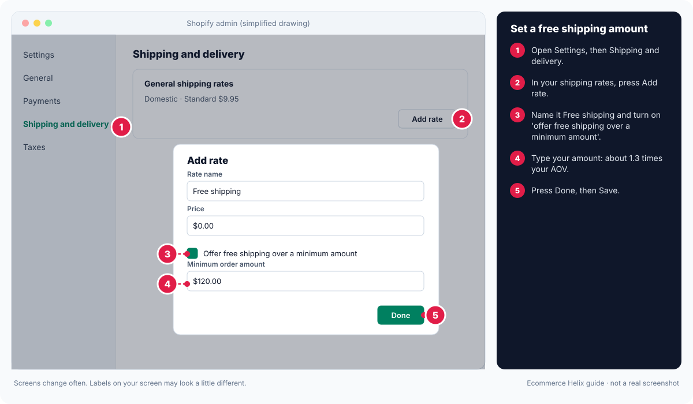

# Module 9: Website, conversion and order value

**Outcome:** a store that turns more visits into sales. It is clear, convincing, easy to buy from, and good at making orders bigger.

**Related SOPs:** [01 Store audit](../sops/01-store-audit.md), [11 Landing pages and CRO](../sops/11-landing-pages-and-cro.md), [12 AOV and cart offers](../sops/12-aov-and-cart-offers.md)

<!-- plain:start -->
> **In plain words**
>
> **What it is:** How to turn more of your visitors into buyers, and get bigger orders.
>
> **Why it matters:** If more visitors buy, every ad dollar goes further without spending more.
>
> **Do this:**
>
> 1. Make the top of each product page clear: what it is, price, reviews, add to cart.
> 2. Remove anything that slows checkout and turn on express payment buttons.
> 3. Set a free shipping amount a bit above your average order.
>
> **Words to know:**
>
> - **Conversion rate:** Out of every 100 visits, how many end in an order. 2% means 2 orders per 100 visits.
> - **Above the fold:** The part of a page you see before you scroll.
> - **Free shipping threshold:** The order amount where shipping becomes free, like 'Free shipping over $100'.
> - **AOV:** Average order value: total sales divided by number of orders.
>
> All words are explained in the [glossary](../glossary.md).
<!-- plain:end -->

---

## Lesson 9.1: The improvement system

CRO means conversion rate optimisation: getting more of your visitors to buy. Use this loop once a month.

1. **Find the gaps.** Score each page against the checklists in Lesson 9.2. List what is missing.
2. **Make a plan.** Rank each gap by how much it should help, divided by how much work it is. Sort into quick wins, small builds and big builds.
3. **Build.** Use apps or your theme settings first. Only pay for custom code once an idea has proven it works.
4. **Measure.** Use heatmaps, session recordings, funnel reports and A/B tests (Lessons 9.8 and 9.9).
5. **Repeat** every month.

## Lesson 9.2: Page checklists

"Above the fold" means what people see before they scroll.

**Homepage, above the fold:**

1. A promo bar at the very top (for example "Free shipping over $80").
2. A simple menu.
3. A top banner with one message. Use a separate image made for mobile.
4. One clear button (call to action).
5. A trust sign (star rating, number of happy customers, or a press logo).

**Homepage, below the fold:** best sellers, categories, reasons to buy, reviews, your founder story, press mentions, and an email sign-up.

**Product page, above the fold:**

1. The product title.
2. One line on what makes it different.
3. Star rating.
4. Price, with an anchor (a compare-at price) or the bundle value.
5. An offer block (for example "Buy 2, save 10%").
6. Size or colour picker.
7. Add to cart button.
8. Delivery estimate.
9. Key trust badges (secure checkout, free returns).

**Product page, below the fold:** reasons to buy, how to use it, photo reviews, FAQs, a comparison, guarantees, and "goes well with" products.

**Collection pages:**

1. Filters where people can pick several options and reset easily.
2. Sort by best selling.
3. Badges: new, best seller, low stock.
4. Quick add to cart.

**Cart and checkout:**

1. A progress bar towards free shipping or a free gift.
2. A spot for one extra product (upsell).
3. Express payment buttons (Shop Pay, Apple Pay, Google Pay, PayPal).
4. No surprise fees.
5. Trust badges and links to your policies.
6. **Decision rule:** if an optional add-on annoys people (for example shipping protection that is ticked by default) and hurts conversion, remove it.

## Lesson 9.3: Accessibility basics

Accessibility means everyone can use your store, including people with poor eyesight or who use a keyboard instead of a mouse.

1. Strong colour contrast between text and background.
2. Alt text on images (a short description for screen readers).
3. The whole site works with just a keyboard.
4. Font sizes that are easy to read.
5. Labels on every form field.
6. Captions on videos.

This is good for customers, and often helps your Google ranking too.

## Lesson 9.4: Speed

Most shoppers use a phone. A slow page loses them before they see what you sell.

1. Compress images and videos (make the files smaller).
2. Remove apps and scripts you do not use.
3. Lazy-load pictures and videos below the fold (they load only when people scroll to them).
4. **Decision rule:** only chase fixes that save 1 to 2 seconds or more. Tiny gains are not worth the effort.
5. Block bot traffic that skews your reports and slows the site.

## Lesson 9.5: Copy that sells

"Copy" means the words on your site.

1. Lead with the result the customer gets.
2. Be specific ("dries in 2 hours", not "dries fast").
3. Use your customers' own words. Reviews are the best source.
4. Answer their worries.
5. Keep sentences short.
6. Use subheadings and bullet points.
7. End with a clear button telling them what to do.

## Lesson 9.6: Policies and service

Good service helps people decide to buy. Make sure you have:

1. A sale terms page: what is excluded and the dates.
2. A returns policy in plain words.
3. Shipping times for each region.
4. Contact options that are easy to find.
5. A help centre with the top questions.
6. Automatic answers for order status and common questions.

## Lesson 9.7: Landing pages

A landing page is a page built for one ad or one offer.

**The usual order of sections:**

1. A hook headline.
2. The problem.
3. Your solution.
4. 3 to 5 reasons to buy.
5. Proof (reviews, results).
6. The offer.
7. FAQ.
8. A final button.

**Types of landing page:** a listicle ("5 reasons..."), a comparison, a founder story, a bundle builder, or a sale collection page (which also helps with Google search).

**How to test one:** build it in 48 hours with a page builder app. Send half the ad traffic to it and half to the normal product page. Keep the winner.

## Lesson 9.8: Measurement

1. **Heatmaps and session recordings** show where people click and scroll. Look for rage clicks (clicking again and again in frustration), dead clicks (clicking something that is not a link) and how far people scroll.
2. **Store reports** show:
   - Sessions (visits).
   - The conversion funnel: sessions, then add to cart, then reached checkout, then purchase.
   - Top landing pages.
   - Phone versus computer.
3. **Google Analytics** shows where visitors come from, which landing pages convert, and visits from AI assistants.
4. **When conversion suddenly drops, check in this order:** tracking, site errors, payment methods, stock, price changes, where traffic came from, and competitor sales.

## Lesson 9.9: A/B testing

An A/B test shows two versions of a page to two halves of your visitors, to see which sells more.

1. Change only **one** thing.
2. Split visitors 50/50.
3. Wait until you are about 95% sure (your testing app shows this as "confidence" or "significance").
4. Write every test and result in a log.

**Ideas to test:** menu layouts, a cart drawer versus a cart page, how you show a free gift, video on the product page, returns messages, versions of a pre-sale page.

Small wins add up over time.

## Lesson 9.10: Order value

AOV means average order value: total sales divided by number of orders. Raising it means each visitor is worth more.

1. **Tiers:** free shipping at one amount, a free gift at a higher amount, a discount at a higher one again.
2. **Bundles** and bundle builders (customers pick items for a set price).
3. **"Goes well with" suggestions** in the cart.
4. **A one-click offer after purchase** (on the thank-you page).
5. **Quantity breaks** ("buy 3, save 15%").
6. **Subscriptions** for things people use up (subscribe and save, with an easy skip).

**Decision rule:** judge every order-value idea by RPV (revenue per visit), not just AOV. A bigger order is no good if fewer people buy.

## Lesson 9.11: Shipping psychology

How you handle shipping changes how much people buy. The drawing below shows how to set a free shipping amount in Shopify.

1. **Set a free shipping amount** a little above your typical order. Put it just above your median order value, which is often about 1.2 to 1.3 times your AOV. Many people add one more item to reach it.
2. **Show delivery estimates** on the product page and in the cart.
3. **Offer express shipping** as a paid upgrade.
4. **Never surprise people with shipping costs at checkout.** It is one of the top reasons people leave without buying.

<!-- guide:shopify-2-free-shipping -->

*Drawing, not a real screenshot. Labels on your screen may look a little different.* Official help: [Shopify: set up shipping rates](https://help.shopify.com/en/manual/fulfillment/setup/shipping-rates/setting-up-shipping-rates)
<!-- /guide:shopify-2-free-shipping -->

## Lesson 9.12: Promotions without destroying margin

Margin is the share of each sale you keep. Big discounts eat it.

1. **Use these instead of store-wide discounts:** free gifts, bundles, early access for your best customers, and loyalty rewards.
2. **If you want to stop discounting so often, do it slowly:**
   - Run fewer sales.
   - Talk more about value.
   - Keep better offers for new customers only.

## Lesson 9.13: Special cases

1. **Expensive products that people think about for a long time:** more content, comparisons, payment plans, samples or swatches, consultations, and longer retargeting (showing ads to past visitors for longer).
2. **Preorders and made-to-order:** clear dispatch dates, an option to pay a deposit, and progress updates.
3. **Video shopping:** videos people can shop from, on product pages and the homepage.
4. **Reviews:** a "wall of love" page, photo reviews, and review requests sent after people have used the product.
5. **Site search:** add synonyms, push best sellers to the top, and never show a "no results" dead end.
6. **Structured product details** (Shopify metafields): consistent product info, better filters, and easier for AI assistants to read.
7. **Wholesale (B2B):** wholesale prices behind a login, and separate catalogs.
8. **Selling overseas:** local currency and duties (see Module 15).

## Lesson 9.14: Working with developers

1. **Before adding an app, check:** cost, how much it slows the site, support, and how hard it is to remove later.
2. **Get cost estimates** for custom work.
3. **Choose a developer** by their past work and a small paid test job.
4. **Write a development brief:** the goal, a user story ("As a shopper, I want..."), the design, how you will know it is done (acceptance criteria), and the deadline.
5. **Decision rule:** only change your whole theme when the current one blocks several important fixes.

## Lesson 9.15: Category patterns from store audits

Stores in the same category usually miss the same things.

| Category | What is usually missing |
| --- | --- |
| Clothing | Size guidance, fit reviews, model height and size, outfit suggestions |
| Kids and baby | Safety proof, age guidance, gift bundles |
| Beauty and supplements | Clear ingredients, how long until results, rules on before-and-after photos, subscriptions |
| Accessories and jewellery | Photos that show size, gift packaging, personalisation |
| Home and living | Dimensions, photos in a room, swatches, clear delivery info |
| Food | What it tastes like, freshness, bundles, subscriptions |
| Pets | Proof for specific pets, refills |

## Self-check

1. What is the funnel you watch in store reports?
2. Where should the free shipping amount sit?
3. Name three alternatives to a store-wide discount.
4. What do you check first when conversion suddenly drops?

Answers

1. Sessions, then add to cart, then reached checkout, then purchase.
2. Just above your median order value (often about 1.2 to 1.3 times AOV).
3. Any three of: a free gift, bundles, early access for best customers, loyalty rewards.
4. Tracking and site errors first, then payments, stock, prices and where traffic came from.

