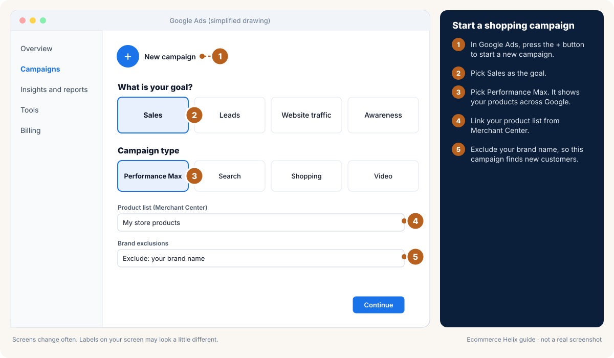
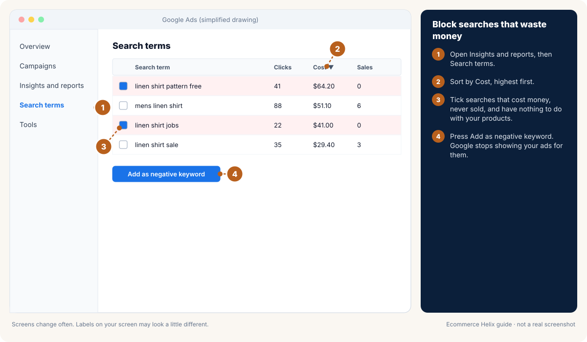

# Module 20: Ad performance analysis, audiences and campaign setup

**Outcome:** you can set up audiences and campaigns correctly on Meta, Google and TikTok, read your results like an analyst, find the real cause of a problem (the ad, the page, the offer or the checkout), and report it in a way that leads to a clear decision.

**Related:** [Module 6 Defining campaigns](06-defining-campaigns.md), [Module 7 Meta ads](07-meta-ads.md), [Module 8 Google ads](08-google-ads.md), [Module 2 Diagnose and fix](02-diagnose-and-fix.md), [SOP 05](../sops/05-meta-structure-and-scaling.md), [SOP 06](../sops/06-meta-daily-optimisation.md), [SOP 09](../sops/09-google-shopping-pmax-search.md)


<!-- plain:start -->
> **In plain words**
>
> **What it is:** How to set up ads correctly and read your results like a pro.
>
> **Why it matters:** Good setup means you can trust the numbers. Good reading means you fix the real problem.
>
> **Do this:**
>
> 1. Check that your pixel and sales tracking work before you spend.
> 2. Set up your campaign step by step (drawings below).
> 3. When results drop, check in order: the ad, the page, the offer, the checkout.
>
> **Words to know:**
>
> - **Pixel:** A small piece of code on your store that tells Meta when someone views, adds to cart or buys.
> - **UTM:** Tags added to the end of a link so your analytics can tell which ad or email a visitor came from.
> - **Attribution:** Deciding which ad or channel gets credit for a sale.
> - **Funnel:** The steps from seeing an ad to buying: visit, add to cart, checkout, order.
>
> All words are explained in the [glossary](../glossary.md).
<!-- plain:end -->

---

## Lesson 20.1: Before you launch: tracking you can trust

Bad data leads to bad decisions. Check these once, then every month.

1. **Your pixel (or Google tag) and server events are connected** through your store platform. Server events are called Conversions API on Meta and enhanced conversions on Google. They send sales from your store's server, so fewer are missed.
2. **Purchase is the only main (primary) conversion** for sales campaigns. Add to cart and other actions are secondary.
3. **The purchase value and currency come through correctly.** Test it with a real order, then refund it.
4. **Deduplication is on.** This stops the same sale being counted twice (once from the browser, once from the server).
5. **Your domain is verified,** and a consent (cookie) banner is set up for the countries you sell to.
6. **Your store's own reports are the truth** for sales and visits. Ad platforms are only for direction.
7. **Every ad link has UTM tags.** UTMs are labels added to the end of a link (like `?utm_source=facebook`) so Google Analytics can tell which channel and campaign each visit came from.

## Lesson 20.2: Setting up target audiences

### Meta

1. **Set up audience segments for the whole account.**
   - Engaged audience: site visitors and people who engaged on social.
   - Existing customers: upload your customer list, or connect your store.
   - This lets reports show how much spend reaches brand-new people.
2. **Build custom audiences** (lists of people who already know you):
   - Site visitors: last 30 and 180 days.
   - Product viewers: last 30 days.
   - Added to cart: last 14 days.
   - Started checkout: last 7 days.
   - Buyers: last 180 days, and all time.
   - Instagram and Facebook engagers: last 365 days.
   - People who watched 50% of a video: last 90 days.
   - Email subscribers.
3. **Build lookalikes** (new people similar to your buyers or best customers) at 1%, 3 to 5% and 10%, for later tests.
4. **Default cold targeting is broad:** your country, age 18 to 65+, all genders (unless the product is clearly for one gender). Treat Meta's audience suggestions as hints only.
5. **Choose exclusions for cold campaigns** (people to leave out):
   - None.
   - Light: recent buyers.
   - Harsh: all buyers and people who engaged.

   Choose based on what you want more: a lower cost per sale, or strictly new customers.
6. **In automated Sales campaigns, cap spend on existing customers,** often at 10 to 20%.

### Google

1. **Upload a customer match list** (your customers) to use as a hint and to leave customers out.
2. **Build remarketing lists:** all visitors (last 30 and 540 days), people who left a cart, and buyers.
3. **Add audience signals to Performance Max:** your customer list, search words you use, and visitors. Signals guide Google. They do not limit who sees the ads.
4. **For Search, the keyword is the audience.** Build negative keyword lists for words you never want: "jobs", "free", "DIY", and competitor brands you will not bid on.

### TikTok

1. **Broad targeting** with country and age is the default.
2. **Custom audiences:** site visitors, video viewers, people who engaged with your profile, and your customer list.
3. **Spark ads** use creator posts or your own free posts, so the likes and comments stay on the post.

### Audiences by layer

The layer is how well the audience knows you (see Module 6).

| Layer | Who | Example targeting |
| --- | --- | --- |
| Cold | Never interacted with you | Broad, with harsh or light exclusions |
| Mixed | Anyone; the platform decides | Automated Sales campaign with a cap on existing customers |
| Warm | Engaged but not bought | Visitors (180 days), engagers, video viewers, leaving out buyers |
| Hot | Close to buying | Added to cart (14 days), started checkout (7 days), leaving out buyers from the last 7 days |
| Existing customers | Bought before | Buyers, for launches and products people reorder |

## Lesson 20.3: Setting up a Meta sales campaign step by step

The drawings below show each step in Ads Manager.

1. **Write the campaign brief first** (Module 6, Lesson 6.16). Know your target CPA, the audience layer, the budget and the stop rule.
2. **Create the campaign.** Choose the objective **Sales**. Then choose automated (Advantage+) or manual setup.
3. **Name it** with your naming pattern, for example `03-Manual-Cold-Broad-Light-TEST-B16`.
4. **Set the budget.** Use a campaign budget for automated campaigns. Use an ad set budget for tight tests. Start at about 2 to 3 times your target CPA per day.
5. **Set the conversion.** Choose Website, the event Purchase, and the attribution setting 7-day click, 1-day view (or whatever setting you always use, so results are comparable).
6. **Set the audience** as in Lesson 20.2. Leave Advantage+ placements on unless you have a good reason.
7. **Add the ads.** Upload 3 to 6 ads per ad set, all testing one thing. Add the main text, the headline, and your link with UTM tags.
8. **Check "creative enhancements".** Turn off anything that changes your message.
9. **Preview on mobile** in every placement. Check text is inside the safe zones.
10. **Publish. Then do not touch it for 3 days** unless something is broken.

**With Helix:** Helix can build steps 2 to 7 for you as a paused draft in your own account. You check it and switch it on.

<!-- guide:meta-1-create-sales-campaign -->


*Drawing, not a real screenshot. Labels on your screen may look a little different.* Official help: [Meta: create a campaign in Ads Manager](https://www.facebook.com/business/help/1658289035439772)
<!-- /guide:meta-1-create-sales-campaign -->

<!-- guide:meta-2-budget-pixel-audience -->


*Drawing, not a real screenshot. Labels on your screen may look a little different.*
<!-- /guide:meta-2-budget-pixel-audience -->

<!-- guide:meta-3-write-the-ad -->


*Drawing, not a real screenshot. Labels on your screen may look a little different.*
<!-- /guide:meta-3-write-the-ad -->

<!-- guide:meta-4-review-helix-draft -->


*Drawing, not a real screenshot. Labels on your screen may look a little different.*
<!-- /guide:meta-4-review-helix-draft -->

## Lesson 20.4: Setting up Google step by step

The drawings below show how to start a Performance Max campaign and block wasted searches.

### Brand search (people searching your name)

1. Create a Search campaign with the Sales goal. Choose the bidding "Maximise conversions" or "Target impression share".
2. Keywords: your brand name and common misspellings, as exact and phrase match.
3. Ads: responsive search ads with sitelinks, callouts, and price or promotion assets.
4. Budget: enough that it is never "limited by budget".

### Shopping or feed-only Performance Max

1. **Fix your product feed first:** titles with the words people search, good images, correct prices, availability, GTIN (barcode) or brand, and product type.
2. **Create Performance Max** with the Sales goal and your linked Merchant Center. Give it only the feed, with no extra images or videos, if you want it to behave like Shopping.
3. **Exclude your brand name,** so people searching your name are handled by the cheap brand campaign.
4. **Split best sellers into their own campaign** when they deserve more budget.
5. **Bidding:** start with "Maximise conversion value". Once you have about 30 or more conversions in 30 days, add a target ROAS. Set it near your real target, not a wish.

### Non-brand search

1. One campaign per product theme, with small, tight keyword groups.
2. Check the search terms report every week. Add negative keywords. Add searches that sell as keywords, and use those words in your product titles.

<!-- guide:google-1-performance-max -->


*Drawing, not a real screenshot. Labels on your screen may look a little different.* Official help: [Google: about Performance Max campaigns](https://support.google.com/google-ads/answer/10724817)
<!-- /guide:google-1-performance-max -->

<!-- guide:google-2-block-wasted-searches -->


*Drawing, not a real screenshot. Labels on your screen may look a little different.* Official help: [Google: add negative keywords](https://support.google.com/google-ads/answer/2453972)
<!-- /guide:google-2-block-wasted-searches -->

## Lesson 20.5: Setting up a TikTok campaign step by step

1. **Objective:** Sales (website conversions, or TikTok Shop).
2. **Pixel event:** Complete payment.
3. **Targeting:** broad. **Budget:** enough for several sales a day per ad group.
4. **Ads:** natural-looking tall videos, Spark ads where you can, 3 to 5 per ad group.
5. **Give it a week.** TikTok's learning is jumpier than Meta's.
6. **Judge it on your total MER as well as TikTok's reported return.** TikTok often causes sales that show up under other channels.

## Lesson 20.6: The metric tree

Sales from ads come from a chain of steps. Find the weak link.

```
Spend
 └─ CPM (cost to show the ad 1,000 times)
     └─ CTR (out of 100 who see it, how many click)   ← the ad and its message
         └─ Cost per click
             └─ Landing page view rate                  ← page speed, tracking
                 └─ Add to cart rate                     ← product page, offer, price
                     └─ Checkout rate                    ← shipping cost, trust, payment options
                         └─ Purchase rate
                             └─ AOV (average order)      ← bundles, free shipping amount, upsells
```

**How to use it:** improve one link and everything below it moves. For example, a 20% better CTR with the same page means 20% more buyers for the same spend.

## Lesson 20.7: Cross-diagnosis: is it the ad, the page, the offer or the checkout?

This is the most useful table in the playbook. Helix runs the same rules for you in **What to fix**.

| What you see | Likely cause | What to check and fix |
| --- | --- | --- |
| Good hook rate and CTR, but few visitors buy | The landing page or offer | Mobile page speed. Does the page match the ad? Is the offer clear at the top? Trust (reviews, guarantee). Mobile checkout. |
| Lots of add to carts, but few finish checkout | Something in checkout puts people off | Surprise shipping cost, a slow or long checkout, missing payment options (Apple Pay, buy now pay later), forced account sign-up, unclear delivery time. |
| Visitors from other channels buy well, but ads get few clicks | The ad itself | New hooks, new angles, new formats. Check the offer is in the ad. |
| Low hook rate, but OK CTR from people who watch | The first seconds | Re-cut the first 3 seconds. Test new visual and spoken hooks. |
| Good hook rate, low hold rate | The middle of the video | Tighten the middle, show the product sooner, add proof. |
| Frequency and CPM rising, CTR falling | People are tired of the ads, or the audience is used up | Launch a new batch of ads. Go broader. Check reach grows with spend. |
| CPM jumps across all campaigns | The season, or more advertisers competing | Expect it in busy periods. Protect your margin and lean on email and SMS. |
| Platform ROAS looks fine, but MER is getting worse | Platforms taking credit for sales they did not cause, often retargeting | Move budget to cold, check the share of new customers, run a holdout test (Lesson 20.9). |
| Plenty of clicks, few landing page views | A slow page or broken tracking | Test page speed. Check the pixel fires when the page loads. |
| Good conversion, small orders | Missing ways to raise order value | Free shipping amount, bundles, a free gift, an offer after purchase. |
| Lots of views, few clicks | Weak call to action, or the wrong people | A clear call to action, the offer in the ad, a hook that attracts buyers not browsers. |
| Lots of refunds after a campaign | The ad promised too much | Make claims match reality. Improve size or fit guidance. |

## Lesson 20.8: Breakdowns that reveal problems

Breakdowns split your results by group in Ads Manager. Look at them weekly, not daily.

1. **Placement:** is one placement (for example Audience Network) spending a lot at a high cost per sale?
2. **Age and gender:** are you paying for people who never buy? Change the ads before you narrow the targeting.
3. **Device:** if phones convert far worse than computers, your mobile site has a problem.
4. **Time:** day-of-week patterns help you plan launches and emails.
5. **Country or region:** give countries their own campaigns when spend allows.
6. **New versus existing customers:** how much of your spend reaches new people?

## Lesson 20.9: Attribution and incrementality

Every platform claims credit for the same sale. Incrementality means sales that would not have happened without the ad. Use these rules:

1. **MER first.** Total ad spend ÷ total sales from your store is the honest number.
2. **Use platform numbers for direction,** especially to compare ads inside one platform.
3. **Track new-customer CAC** (ad spend ÷ number of new customers). It tells you if growth is real.
4. **Run holdout tests.** Pause a channel or campaign in one region, or for one week, and watch total sales. If sales do not drop, those ads were not adding sales.
5. **Ask buyers after they purchase:** "Where did you first hear about us?" Combine the answers with your data.

## Lesson 20.10: Your analysis rhythm

| When | Time | What to do |
| --- | --- | --- |
| Daily | 10 minutes | Read your scorecard (MER, contribution profit). Stop money-wasting ads. Give more to winners. Check spend is on pace. |
| Weekly | 45 minutes | Ad report (hook rate, hold rate, CTR and cost per sale by idea), breakdowns, search terms, brief the next batch. |
| Monthly | 2 hours | MER and contribution profit against target, share of new customers, channel mix, test results, next month's plan. |
| Every 3 months | Half a day | A holdout test, a review of your account setup, and the budget plan for the next busy season. |

## Lesson 20.11: Reporting that leads to decisions

Every report answers four questions:

1. **What happened?** Three numbers: sales, contribution profit, and MER compared with target.
2. **Why?** The one or two biggest causes, with evidence.
3. **What did we do?** Actions taken this period.
4. **What next?** The next three actions, with who owns each one and by when.

**Avoid dashboards with 40 numbers.** If a number would not change a decision, drop it.

## Lesson 20.12: Common analysis mistakes

1. Judging an ad after one day or $10 of spend.
2. Comparing ROAS with other stores or other seasons, instead of with your own break-even.
3. Turning off an ad set the platform calls "bad" while your MER is getting better.
4. Reading CTR without checking what happens after the click.
5. Editing campaigns every day, so they never finish learning.
6. Trusting the total of what each platform says it earned. It is usually more than your real sales.

## Self-check

1. Hook rate 35%, CTR 1.6%, conversion rate 0.6%. Where is the problem?
2. Your add to cart rate is double normal, but few people check out. What three things do you check first?
3. Platform ROAS is stable but MER is rising. What might be happening?
4. Why start Google Performance Max as feed-only, with your brand excluded?
5. Name four custom audiences to build on day one.

<details><summary>Answers</summary>

1. The ad works. The page or offer does not. Check speed, whether the page matches the ad, how clear the offer is, trust signs and mobile checkout.
2. Surprise shipping cost, checkout steps and payment options, and forced account sign-up.
3. Retargeting or double-counting is taking credit while fewer new customers arrive. Move budget to cold, check the share of new customers, and run a holdout test.
4. It behaves like Shopping (clearer data), and it stops Performance Max claiming cheap brand searches as its own wins.
5. Any four of: visitors (30 and 180 days), product viewers, add to cart, started checkout, buyers, engagers, video viewers, email list.

</details>
