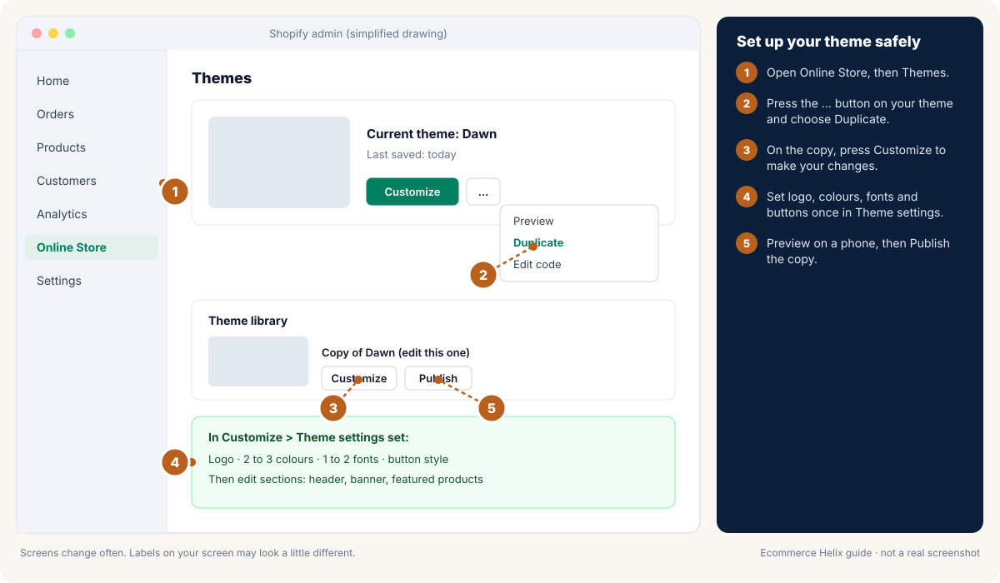
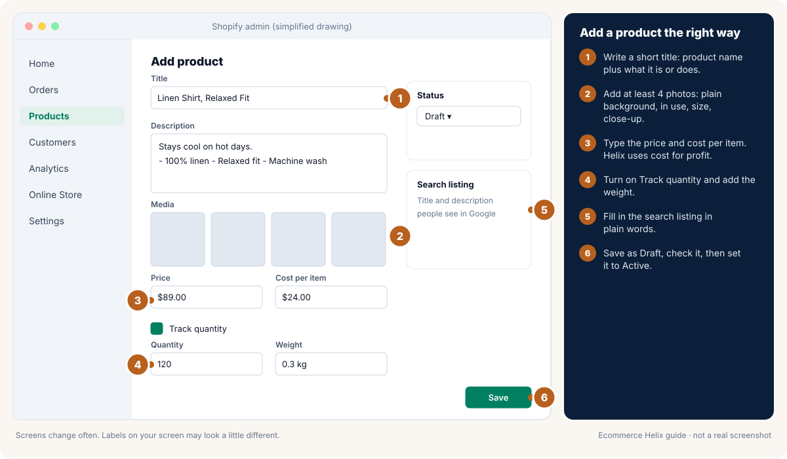
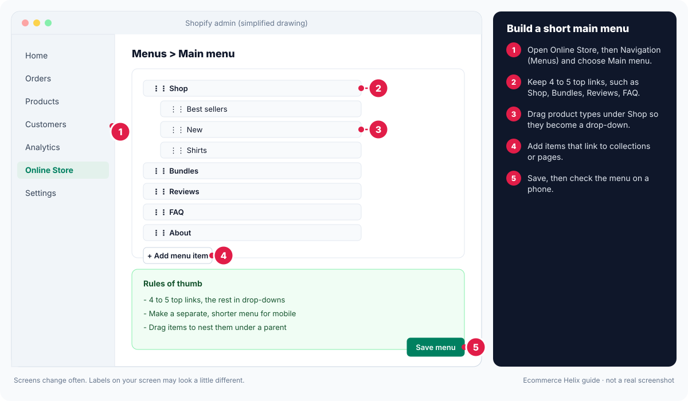
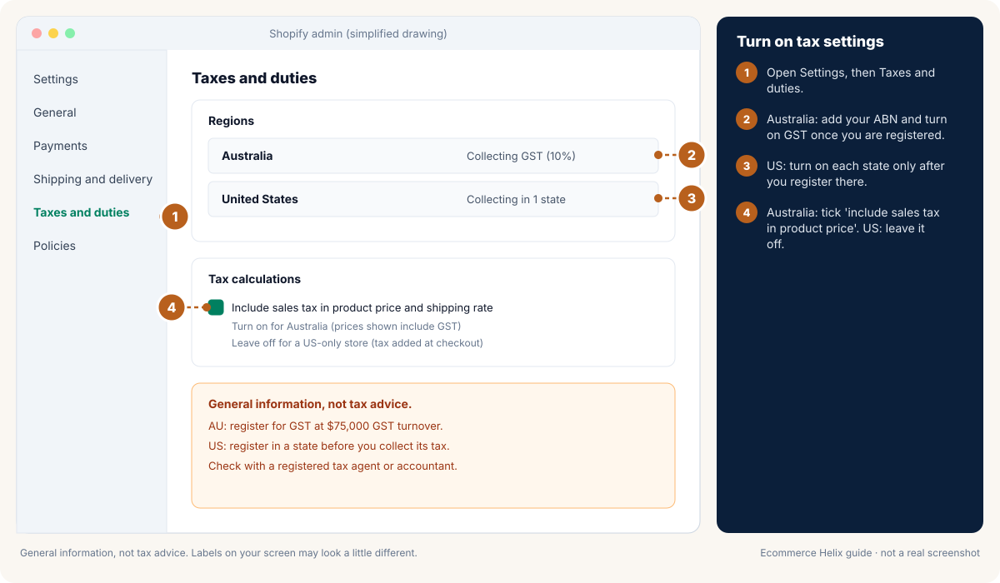
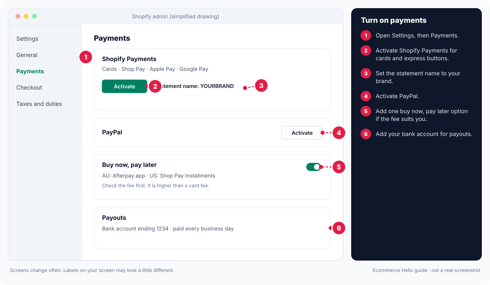
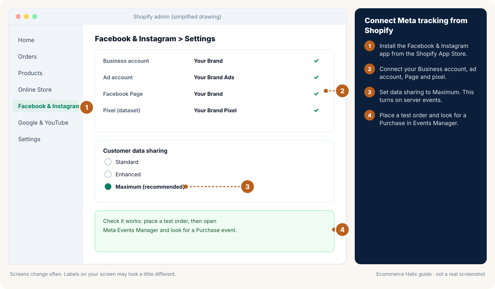
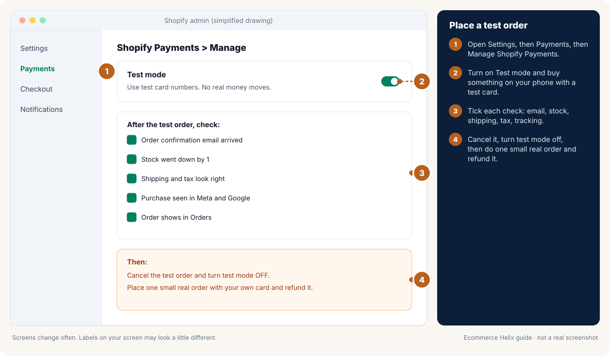

# Module 22: Shopify store setup

**Outcome:** a Shopify store that is ready to take real orders. It has your own domain, a fast theme, clear home and product pages, working shipping, taxes and payments, plain policies, a small set of apps, tracking for your ads, and a test order that went through from start to finish.

**Related:** [Module 9 Website, conversion and order value](09-website-and-cro.md), [Module 18 Choosing your tool stack](18-tool-stack.md), [Module 7 Meta ads in practice](07-meta-ads.md), [Module 1 Daily profit foundations](01-daily-profit-foundations.md)

<!-- plain:start -->
> **In plain words**
>
> **Stage:** Convert (turn visits into sales). Every lesson below is tagged with its stage; see [Attract, Convert, Grow](stages.md).
>
> **What it is:** Step by step, how to set up a Shopify store that is ready to take real orders.
>
> **Why it matters:** A clear, fast, trustworthy store makes every ad dollar go further. Mistakes in tax, payments or tracking are hard to fix later.
>
> **Do this:**
>
> 1. Get your domain, pick a free theme and build the home and product pages.
> 2. Set shipping, taxes, payments and plain-language policies.
> 3. Install tracking, check speed on a phone and place a test order before launch.
>
> **Words to know:**
>
> - **Theme:** The design template for your Shopify store. It controls how every page looks.
> - **Domain:** Your store's web address, like yourbrand.com.
> - **Variant:** One option of a product, like a size or colour, with its own stock and price.
> - **GST:** Goods and services tax: 10% in Australia (15% in New Zealand), added to most sales once you are registered.
> - **Sales tax:** In the US, a tax set by each state (and some cities) that the seller collects at checkout.
> - **Test order:** A pretend order you place yourself to check payments, emails and tracking work.
>
> All words are explained in the [glossary](../glossary.md).
<!-- plain:end -->

---

## Lesson 22.1: Plan before you build
<!-- stage:convert -->

A store takes days to build and minutes to judge. Plan first so you build only what a buyer needs.

**Do this:**

1. Write your one-line promise: who it is for and the result they get.
2. List your products. For each, write the price, product cost and what one order costs you to send.
3. Choose your launch country. Pick one (Australia or the US) and add more later.
4. Pick a plan. Most new stores start on the cheapest plan that includes the features you need. Check current prices on [Shopify pricing](https://www.shopify.com/pricing).
5. Collect what you will need: logo, 4 to 8 photos per product, your returns rule, your ABN (Australia) or EIN (US, if you have one), and a business bank account.

**Australia:** have your ABN ready. If you expect sales of $75,000 or more in a year, read [Lesson 22.10](#lesson-2210-taxes-gst-and-sales-tax-basics) before you set prices.

**US:** decide which state you sell from. Your home state is where you are most likely to owe sales tax first.

**Self-check:** can you say in one sentence what you sell and who it is for? Do you know your cost per order?

## Lesson 22.2: Domain and email
<!-- stage:convert -->

Your domain is your web address. A store on its own domain looks more trustworthy than one on the free `myshopify.com` address.

**Do this:**

1. Buy a short domain that matches your brand. Buy it inside Shopify, or connect one you already own. See [Shopify: domains](https://help.shopify.com/en/manual/domains).
2. **Australia:** a `.com.au` needs an ABN. Many brands own both `.com.au` and `.com`. **US:** a `.com` is the normal choice.
3. Make your main domain the one customers see. The `myshopify.com` address should redirect to it.
4. Set up a branded email, such as hello@yourbrand.com. Use it for support and as the sender in your email tool.
5. Send a test email to yourself and check it does not land in spam.

**Self-check:** does typing your domain open your store? Do emails come from your own domain?

## Lesson 22.3: Choose and set up a theme
<!-- stage:convert -->

The theme is the design of your store. A fast, simple theme beats a fancy slow one.

**Do this:**

1. Start with a free Shopify theme. Dawn and the other free themes are fast and well supported. See [Shopify: themes](https://help.shopify.com/en/manual/online-store/themes).
2. Only pay for a theme if it has a feature you truly need and you have checked its speed on a phone.
3. Set your brand basics once in Theme settings: logo, 2 to 3 colours, 1 to 2 fonts, button style.
4. Always edit a copy. Duplicate the theme, make changes on the copy, preview it, then publish.
5. Plan the menus for desktop and mobile separately. Phones need fewer, bigger links.

**Self-check:** does your store use no more than 2 fonts and 3 main colours? Are you working on a copy of the theme?

<!-- guide:shopify-3-theme-editor -->

*Drawing, not a real screenshot. Labels on your screen may look a little different.* Official help: [Shopify: themes](https://help.shopify.com/en/manual/online-store/themes)
<!-- /guide:shopify-3-theme-editor -->

## Lesson 22.4: Build the home page
<!-- stage:convert -->

The home page should answer three questions in a few seconds: what is this, is it for me, and why should I trust it.

**Top of the page (what people see first):**

1. **Promo bar:** one short line, such as your shipping offer or a guarantee.
2. **Header and menu:** logo plus 4 to 5 links at most, for example Shop, Bundles, Reviews, FAQ, About.
3. **Banner:** a clear photo of the product in use, your promise in one line and one button ("Shop now").
4. **Second row of links (optional):** small category tiles or icons so people jump straight to what they want. On mobile, a row people can scroll sideways works well.

**Lower down, in this order:**

1. What makes you different, in 3 short points.
2. Best sellers with prices.
3. Reasons to buy, shown with icons or short lines.
4. Proof: star rating, number of customers, press or awards.
5. How it works, as 3 steps or a short video.
6. Real customer photos and reviews.
7. Expert or partner backing if you have it.
8. Email sign-up and a simple footer with policies and contact.

**Self-check:** ask someone new to look at your home page on a phone for 5 seconds. Can they say what you sell?

## Lesson 22.5: Product pages: titles, photos and descriptions
<!-- stage:convert -->

Most buying decisions happen here. Answer every worry before the buyer has to ask.

**Do this:**

1. **Title:** the product name plus the main thing it does or is made of, such as "Linen Shirt, Relaxed Fit". Keep it short.
2. **Photos:** at least 4. Include one on a plain background, one in use, one showing size or scale, and one close-up of the key detail. Use the same shape for every photo (square works everywhere).
3. **Near the top:** price, star rating with review count, your promise line and the Add to cart button.
4. **Description:** short lines, not long paragraphs. Lead with the result, then 3 to 5 key points, then what is included.
5. **Questions that sell:** add a short FAQ under the button: sizing, materials, shipping time, returns, care.
6. **Sticky add to cart:** on mobile, keep the button visible as people scroll (most themes have this setting).
7. **SEO basics:** fill in the search title and description in plain words. See [Shopify: products](https://help.shopify.com/en/manual/products/add-update-products).

**Self-check:** on a phone, can you see the price, rating and Add to cart button without scrolling?

<!-- guide:shopify-4-add-product -->

*Drawing, not a real screenshot. Labels on your screen may look a little different.* Official help: [Shopify: adding products](https://help.shopify.com/en/manual/products/add-update-products)
<!-- /guide:shopify-4-add-product -->

## Lesson 22.6: Variants and inventory
<!-- stage:convert -->

Variants are the options of one product, such as size or colour. Inventory is how many you have.

**Do this:**

1. Add options (Size, Colour) to one product instead of making separate products for each. See [Shopify: variants](https://help.shopify.com/en/manual/products/variants).
2. Give each variant its own photo, price (if different), SKU and stock count.
3. Turn on "Track quantity" so Shopify stops selling when you run out. See [Shopify: inventory](https://help.shopify.com/en/manual/products/inventory).
4. Decide what happens at zero stock. Most new stores should stop selling. If you take pre-orders, say the ship date clearly.
5. Fill in product cost on every variant. Helix uses it to work out your profit.
6. Add weight to every variant so shipping rates calculate correctly.

**Self-check:** does every variant have a photo, SKU, stock count, cost and weight?

## Lesson 22.7: Reviews
<!-- stage:convert -->

People trust other customers more than they trust you. A review app collects and shows reviews for you.

**Do this:**

1. Install one review app that collects photo reviews and sends an automatic request email after delivery.
2. Show the star rating under the product title and near the Add to cart button.
3. Add a section of reviews with photos lower on the product page and on the home page.
4. Ask early buyers, testers and friends who used the product for honest reviews. Never write fake reviews or pay for positive ones. Both breach consumer law in Australia and the US.
5. Reply to negative reviews politely and fix the problem. Do not hide them.

**Self-check:** is your rating visible near the top of every product page?

## Lesson 22.8: Collections, menus and search
<!-- stage:convert -->

Collections are groups of products. Menus and search help people find them quickly.

**Do this:**

1. Make a few clear collections: Best sellers, New, and one per product type. Use automatic collections where you can so they update themselves. See [Shopify: collections](https://help.shopify.com/en/manual/products/collections).
2. Build the main menu with 4 to 5 links. Put deeper links in drop-downs. See [Shopify: menus](https://help.shopify.com/en/manual/online-store/menus-and-links).
3. Turn on Shopify's own filters (size, colour, price, in stock). They are enough for most stores. Let people pick more than one option.
4. Show a second photo when a shopper hovers over a product, and add a quick-add button if your theme allows.
5. Test search: type your top 5 product words and a common misspelling. Fix what does not show up.

**Self-check:** can a new visitor reach any product in 3 taps or fewer?

<!-- guide:shopify-5-menus -->

*Drawing, not a real screenshot. Labels on your screen may look a little different.* Official help: [Shopify: menus and links](https://help.shopify.com/en/manual/online-store/menus-and-links)
<!-- /guide:shopify-5-menus -->

## Lesson 22.9: Shipping zones, rates and a free-shipping amount
<!-- stage:convert -->

Surprise shipping costs are one of the main reasons people leave at checkout. Make shipping clear and simple.

**Do this:**

1. In Settings, open Shipping and delivery. Create a zone for your home country first.
2. Add 1 or 2 rates: Standard and Express. Price them from your real carrier costs, or use calculated rates.
3. Set a free-shipping amount a bit above your average order (about 1.2 to 1.4 times). This nudges people to add one more item.
4. Show the free-shipping amount in the promo bar and near the Add to cart button. Test wording: "Free shipping over $X" often reads more simply than other phrasing.
5. Write delivery times as a range ("arrives in 3 to 6 business days"). Do not promise exact dates you cannot control.
6. Add international zones later, once your home country works.

**Australia:** compare Australia Post, Sendle and couriers. Remote areas can cost much more; set a separate rate if needed. **US:** compare USPS, UPS and FedEx rates through Shopify Shipping.

**Self-check:** does checkout show a clear shipping price and delivery range for your home country?

<!-- guide:shopify-2-free-shipping -->

*Drawing, not a real screenshot. Labels on your screen may look a little different.* Official help: [Shopify: set up shipping rates](https://help.shopify.com/en/manual/fulfillment/setup/shipping-rates/setting-up-shipping-rates)
<!-- /guide:shopify-2-free-shipping -->

## Lesson 22.10: Taxes: GST and sales tax basics
<!-- stage:convert -->

> **General information, not tax or legal advice.** Tax rules change and depend on your situation. Check with a registered tax agent or accountant before you decide.

**Australia (GST):**

1. You must register for GST within 21 days of your GST turnover reaching $75,000 or more (this month plus the previous 11 months), or if you expect to reach it in the next 12 months. You can register earlier if you choose. See [ATO: registering for GST](https://www.ato.gov.au/businesses-and-organisations/gst-excise-and-indirect-taxes/gst/registering-for-gst).
2. Prices shown to Australian shoppers should include GST once you are registered. In Shopify, open Settings, then Taxes and duties, and turn on "Include sales tax in product price and shipping rate". See [Shopify: taxes in Australia](https://help.shopify.com/en/manual/taxes/australia).
3. If you are not registered, do not charge GST and do not call your invoices tax invoices.
4. GST you collect belongs to the ATO, not you. Helix takes it out for you: in Helix Settings, "My prices include GST/VAT" is on by default for Australian stores, so the sales you type (for example Shopify's Total sales, which includes tax) are divided by 1.1 before any profit maths. If you copy Shopify's Gross sales or Net sales reports instead, which already leave tax out, or you are not registered, switch it to "No". New Zealand (15%) and UK (20%) are there too.

**US (sales tax):**

1. You usually need to collect sales tax in states where you have a physical presence (nexus), such as your home state or a warehouse.
2. Most states also have an economic nexus rule, often $100,000 of sales into that state in a year. Rules differ by state.
3. Register with a state before you collect its tax. Then turn that state on in Shopify under Settings, then Taxes and duties. See [Shopify: US taxes](https://help.shopify.com/en/manual/taxes/us).
4. Shopify can track how close you are to each state's threshold.

**Self-check:** do you know whether you need to register, and have you set tax-inclusive (AU) or state-by-state (US) settings?

<!-- guide:shopify-6-taxes -->

*Drawing, not a real screenshot. Labels on your screen may look a little different.* Official help: [Shopify: taxes](https://help.shopify.com/en/manual/taxes)
<!-- /guide:shopify-6-taxes -->

## Lesson 22.11: Payments
<!-- stage:convert -->

Let people pay the way they like. Every extra step at checkout loses buyers.

**Do this:**

1. Turn on Shopify Payments if it is available in your country. It accepts cards and usually has lower total fees than a separate gateway. See [Shopify Payments](https://help.shopify.com/en/manual/payments/shopify-payments).
2. Turn on express buttons: Shop Pay, Apple Pay and Google Pay.
3. Add PayPal. Many shoppers still prefer it. See [Shopify: PayPal](https://help.shopify.com/en/manual/payments/paypal).
4. Consider one buy now, pay later option. **Australia:** Afterpay is widely known. **US:** Shop Pay Installments is built in. See [Shop Pay Installments](https://help.shopify.com/en/manual/payments/shop-pay-installments). Check the fee, because it is higher than a card fee.
5. Set your payout bank account and statement name (the name that appears on bank statements). Make it match your brand so customers recognise the charge.

**Self-check:** can a shopper pay with a card, Shop Pay, Apple Pay and PayPal? Does your brand name show on statements?

<!-- guide:shopify-7-payments -->

*Drawing, not a real screenshot. Labels on your screen may look a little different.* Official help: [Shopify Payments](https://help.shopify.com/en/manual/payments/shopify-payments)
<!-- /guide:shopify-7-payments -->

## Lesson 22.12: Policies and legal pages
<!-- stage:convert -->

Clear policies build trust and keep you within the law. Write them in plain words.

**Do this:**

1. Create Refund, Privacy, Terms of service, Shipping and Contact pages. Shopify has templates to start from. See [Shopify: store policies](https://help.shopify.com/en/manual/checkout-settings/refund-privacy-tos).
2. Rewrite the templates in plain language. Add your own cut-off dates and delivery ranges.
3. Link every policy in the footer and near checkout.

**Australia:** under Australian Consumer Law, customers always have rights to a repair, replacement or refund when a product is faulty, not as described or not fit for purpose. Do not write "no refunds" or "no refunds on sale items". Change-of-mind returns are your choice. See [ACCC: consumer guarantees](https://www.accc.gov.au/consumers/buying-products-and-services/consumer-rights-and-guarantees).

**US:** if you state a shipping time, the FTC mail order rule expects you to ship within it (or within 30 days if you state none), and to tell buyers about delays. See [FTC: mail order rule](https://www.ftc.gov/business-guidance/resources/business-guide-ftcs-mail-internet-or-telephone-order-merchandise-rule).

**Both:** only email people who agreed to it, and include an unsubscribe link in every marketing email.

> **General information, not legal advice.** Check your policies with a lawyer if you are unsure.

**Self-check:** is every policy linked in the footer and written so a 12-year-old could follow it?

## Lesson 22.13: Essential apps (and only those)
<!-- stage:convert -->

Every app can slow your store and adds a monthly cost. Start with a small set.

**The starter set:**

1. **Reviews:** collects and shows photo reviews.
2. **Email and SMS:** Shopify Email or Klaviyo for sign-ups, welcome and abandoned checkout emails.
3. **Facebook and Instagram** and **Google and YouTube** sales channels for tracking and product feeds.
4. **Post-purchase offer (optional):** adds a one-click offer after checkout. This is one of the few features that truly needs an app.
5. **Subscriptions (only if you sell refills or consumables).**

**Rules:**

1. Check if your theme can do it first. Many features (badges, size charts, FAQs) are built in.
2. Install new apps on a copy of your theme and test speed before and after.
3. Remove apps you stop using, and check they left no code behind.

See [Module 18](18-tool-stack.md) for when to add more.

**Self-check:** can you name what each installed app does and what it costs each month?

## Lesson 22.14: Tracking: Meta pixel, Google tag and analytics
<!-- stage:attract -->

Without tracking, you cannot tell which ads bring sales. Set it up before you spend a dollar on ads.

**Do this:**

1. Install the **Facebook and Instagram** app from Shopify. Connect your Business account, ad account, page and pixel. See [Shopify: Facebook and Instagram](https://help.shopify.com/en/manual/online-sales-channels/facebook-instagram-by-meta).
2. Set data sharing to the highest level. This turns on server events, which send sales to Meta even when a browser blocks the pixel.
3. Install the **Google and YouTube** app. Connect Google Merchant Center, Google Ads and Google Analytics 4. See [Shopify: Google](https://help.shopify.com/en/manual/online-sales-channels/google).
4. Check your privacy and cookie settings in Shopify's customer privacy settings. See [Shopify: customer events](https://help.shopify.com/en/manual/promoting-marketing/analyze-marketing/customer-events).
5. Place a test order (Lesson 22.16) and check a Purchase shows in Meta Events Manager and in Google.

**Self-check:** does one test order show up as a Purchase in Meta and in Google?

<!-- guide:shopify-8-meta-tracking -->

*Drawing, not a real screenshot. Labels on your screen may look a little different.* Official help: [Shopify: Facebook and Instagram](https://help.shopify.com/en/manual/online-sales-channels/facebook-instagram-by-meta)
<!-- /guide:shopify-8-meta-tracking -->

## Lesson 22.15: Speed and mobile
<!-- stage:convert -->

Most shoppers are on a phone. A slow store wastes every ad dollar.

**Do this:**

1. Test your home page and a product page in [PageSpeed Insights](https://pagespeed.web.dev/). Look at the mobile score and Core Web Vitals.
2. Shrink images before you upload them. Most photos look fine under 300 KB.
3. Keep videos short and compressed. A video of many megabytes that plays on load slows everything down.
4. Remove apps and sections you do not use.
5. Open your store on your phone using mobile data and try to buy something. Fix anything that is hard to tap or read.

**Self-check:** does your product page load in about 3 seconds on mobile data?

## Lesson 22.16: Place test orders
<!-- stage:convert -->

A test order proves that payments, emails, stock and tracking all work together.

**Do this:**

1. Turn on test mode for Shopify Payments, or use the Bogus Gateway. See [Shopify: test orders](https://help.shopify.com/en/manual/checkout-settings/test-orders).
2. Place an order on your phone as a customer would. Use a discount code if you have one.
3. Check: the confirmation email arrived, stock went down by one, shipping and tax were right, and a Purchase showed in Meta and Google.
4. Refund or cancel the test order, then turn test mode off.
5. Place one small real order with your own card and refund it. This checks live payments.

**Self-check:** did a real card payment go through and appear in your payouts?

<!-- guide:shopify-9-test-order -->

*Drawing, not a real screenshot. Labels on your screen may look a little different.* Official help: [Shopify: test orders](https://help.shopify.com/en/manual/checkout-settings/test-orders)
<!-- /guide:shopify-9-test-order -->

## Lesson 22.17: Pre-launch checklist
<!-- stage:convert -->

Tick every item before you launch or turn on ads.

| Area | Check |
| --- | --- |
| Domain | Own domain is primary; emails come from your domain |
| Theme | Published copy you tested; logo, colours and fonts set |
| Home page | Promise, one button and proof visible on a phone |
| Products | 4+ photos, price, rating, FAQ, cost and weight on every variant |
| Collections and menu | 4 to 5 menu links; filters on; search works |
| Shipping | Home zone, clear rates, free-shipping amount shown |
| Taxes | GST or state settings checked (with your accountant) |
| Payments | Cards, Shop Pay, Apple Pay, PayPal; statement name set |
| Policies | Refund, privacy, terms, shipping and contact linked in footer |
| Apps | Only the starter set; speed checked after each |
| Tracking | Test Purchase seen in Meta and Google |
| Speed | Mobile pages load in about 3 seconds |
| Password | Store password removed when you are ready to launch |

**Self-check:** every row ticked? Then start your 2-minute morning numbers in Helix and plan your first small test campaign.
